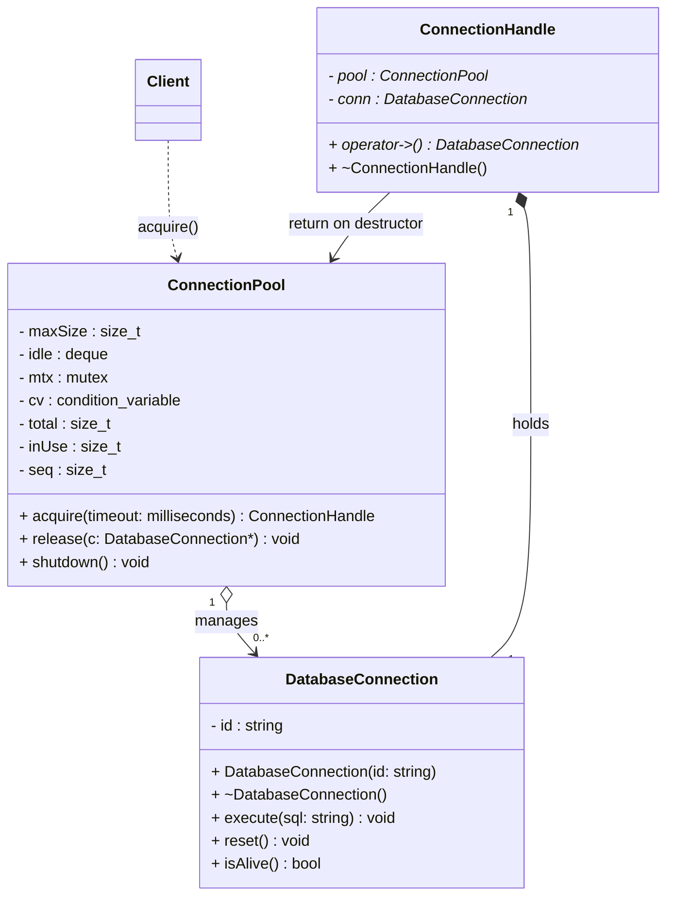
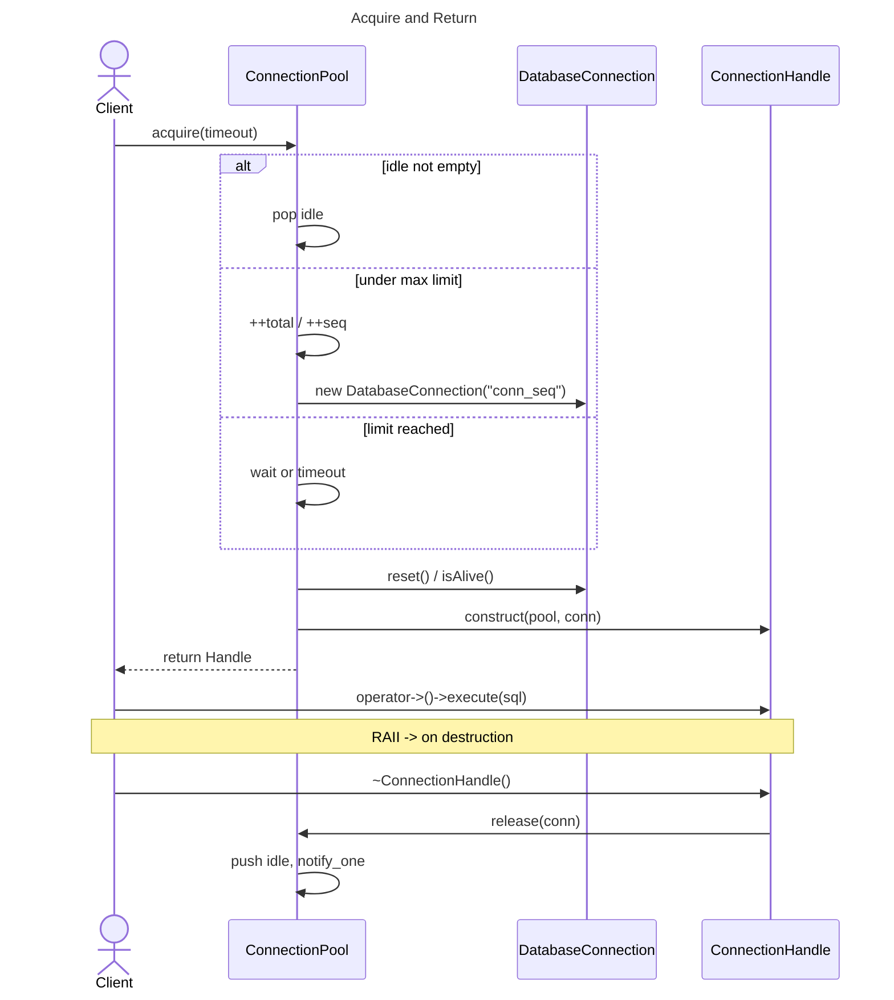

当你在写数据库、文件系统或网络这类“重资源”代码时，最怕两件事：一是频繁创建/销毁带来的性能抖动，二是资源忘记释放导致的各种诡异事故。更靠谱的做法是把资源复用起来，用**对象池（Object Pool）**兜住；同时把“复用还是新建”的决定权，集中在一个统一入口里。这就是**工厂方法（Factory Method）**能派上用场的地方。

```mermaid
classDiagram  
    class Client  

    class ConnectionPool {  
      - maxSize : size_t  
      - idle : deque<DatabaseConnection*>  
      - mtx : mutex  
      - cv : condition_variable  
      - total : size_t  
      - inUse : size_t  
      - seq : size_t  
      + acquire(timeout: milliseconds) ConnectionHandle  
      + release(c: DatabaseConnection*) void  
      + shutdown() void  
    }  

    class ConnectionHandle {  
      - pool : ConnectionPool*  
      - conn : DatabaseConnection*  
      + operator->() DatabaseConnection*  
      + ~ConnectionHandle()  
    }  

    class DatabaseConnection {  
      - id : string  
      + DatabaseConnection(id: string)  
      + ~DatabaseConnection()  
      + execute(sql: string) void  
      + reset() void  
      + isAlive() bool  
    }  

    Client ..> ConnectionPool : acquire()  
    ConnectionPool "1" o--> "0..*" DatabaseConnection : manages  
    ConnectionHandle "1" *-- "1" DatabaseConnection : holds  
    ConnectionHandle --> ConnectionPool : return on destructor  
```

```mermaid
sequenceDiagram  
    title Acquire and Return  

    actor Client  
    participant Pool as ConnectionPool  
    participant Conn as DatabaseConnection  
    participant Handle as ConnectionHandle  

    Client->>Pool: acquire(timeout)  
    alt idle not empty  
        Pool->>Pool: pop idle  
    else under max limit  
        Pool->>Pool: ++total / ++seq  
        Pool->>Conn: new DatabaseConnection("conn_seq")  
    else limit reached  
        Pool->>Pool: wait or timeout  
    end  
    Pool->>Conn: reset() / isAlive()  
    Pool->>Handle: construct(pool, conn)  
    Pool-->>Client: return Handle  

    Client->>Handle: operator->()->execute(sql)  

    Note over Client,Handle: RAII -> on destruction  
    Client->>Handle: ~ConnectionHandle()  
    Handle->>Pool: release(conn)  
    Pool->>Pool: push idle, notify_one
```

